# 前言

在实际开发中,会经常用到各种各样的对话框,Android 也提供了丰富的dialog函数.再次记录下Android 对话框的几种实现方式,以及自定义Dialog.

[TOC]

#普通对话框

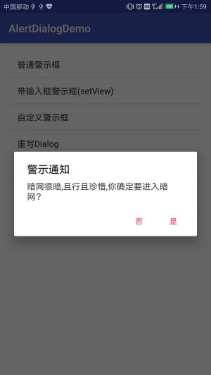

	private void showAlert() {
			new AlertDialog.Builder(this)
					.setTitle("激活通知")
					.setMessage("此账户未激活,是否发送激活信息？")
					.setPositiveButton("是", new DialogInterface.OnClickListener() {
						@Override
						public void onClick(DialogInterface dialogInterface, int i) {
							new Thread(checkActivation).start();
						}
					})
					.setNegativeButton("否", null)
					.show();
		}

# 输入框的对话框

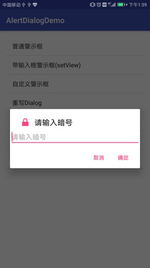

~~~
private void showActivation() {
		LayoutInflater factory = LayoutInflater.from(LoginActivity.this);//提示框
		final View view = factory.inflate(R.layout.alert_activation, null);//这里必须是final的
		final EditText edit = (EditText) view.findViewById(R.id.etCheckcode);//获得输入框对象
		new AlertDialog.Builder(this)
				.setTitle("请输入验证码")
				.setIcon(android.R.drawable.ic_dialog_info)
				.setView(view)
				.setPositiveButton("确定", new DialogInterface.OnClickListener() {
					@Override
					public void onClick(DialogInterface dialogInterface, int i) {
						String checkCode = edit.getText().toString();
						new Thread(startActivation).start();
						})
				.setNegativeButton("取消", null)
				.show();
	}
						
~~~

# 自定义布局实现对话框

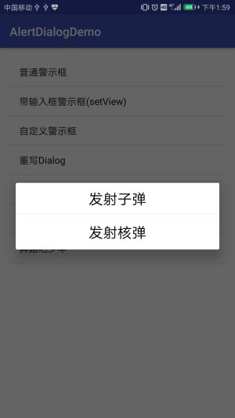

警示框弹出，主要有从相册中选取和调用照相机等两个按钮，按钮为自定义布局（两个TextView），具体布局方式很简单.

警示框主要实现方法代码如下：

~~~
private void showTypeDialog() {
	AlertDialog.Builder builder = new AlertDialog.Builder(this);
	final AlertDialog dialog = builder.create();
	View view = View.inflate(this, R.layout.dialog_select_img, null);
	TextView tv_select_gallery = (TextView) view.findViewById(R.id.tv_select_gallery);
	TextView tv_select_camera = (TextView) view.findViewById(R.id.tv_select_camera);
	tv_select_gallery.setOnClickListener(new View.OnClickListener() {// 在相册中选取
		@Override
		public void onClick(View v) {
			selectFromAlbum();
			dialog.dismiss();
		}
	});
	tv_select_camera.setOnClickListener(new View.OnClickListener() {// 调用照相机
		@Override
		public void onClick(View v) {
			openCamera(UserinfoActivity.this);
			dialog.dismiss();
		}
	});
	dialog.setView(view);
	dialog.show();
}
~~~

# 列表对话框

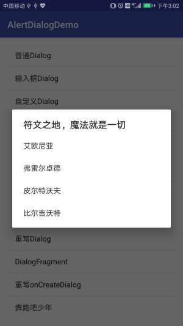

代码如下:

~~~
/**
	 * 列表Dialog
	 *
	 * @param context
	 */
	public static void showListDialog(final Context context) {
		final String[] items = {"艾欧尼亚", "弗雷尔卓德", "皮尔特沃夫", "比尔吉沃特"};
		AlertDialog.Builder listDialog =
				new AlertDialog.Builder(context);
		listDialog.setTitle("符文之地，魔法就是一切");
		listDialog.setItems(items, new DialogInterface.OnClickListener() {
			@Override
			public void onClick(DialogInterface dialog, int which) {
				// which 下标从0开始
				// ...To-do
				Toast.makeText(context,
						"你点击了" + items[which],
						Toast.LENGTH_SHORT).show();
			}
		});
		listDialog.show();
	}
~~~

# 单选对话框

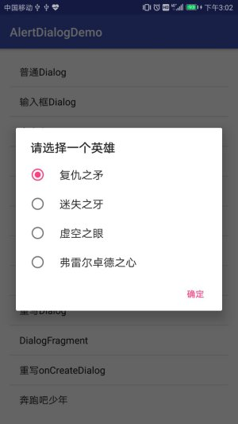

代码如下:

~~~
/**
	 * 单选Dialog
	 *
	 * @param context
	 */
	public static void showSingleChoiceDialog(final Context context) {
		final String[] items = {"复仇之矛", "迷失之牙", "虚空之眼", "弗雷尔卓德之心"};
		yourChoice = -1;
		AlertDialog.Builder singleChoiceDialog =
				new AlertDialog.Builder(context);
		singleChoiceDialog.setTitle("请选择一个英雄");
		// 第二个参数是默认选项，此处设置为0
		singleChoiceDialog.setSingleChoiceItems(items, 0,
				new DialogInterface.OnClickListener() {
					@Override
					public void onClick(DialogInterface dialog, int which) {
						yourChoice = which;
					}
				});
		singleChoiceDialog.setPositiveButton("确定",
				new DialogInterface.OnClickListener() {
					@Override
					public void onClick(DialogInterface dialog, int which) {
						if (yourChoice != -1) {
							Toast.makeText(context,
									"你选择了" + items[yourChoice],
									Toast.LENGTH_SHORT).show();
						}
					}
				});
		singleChoiceDialog.show();
	}
~~~

# 多选对话框

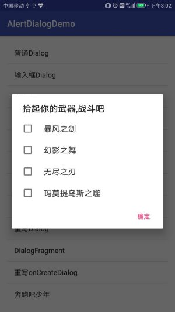

代码如下:

~~~
static ArrayList<Integer> yourChoices = new ArrayList<>();

	/**
	 * 多选Dialog
	 * @param context
	 */
	public static void showMultiChoiceDialog(final Context context) {
		final String[] items = {"暴风之剑", "幻影之舞", "无尽之刃", "玛莫提乌斯之噬"};
		// 设置默认选中的选项，全为false默认均未选中
		final boolean initChoiceSets[] = {false, false, false, false};
		yourChoices.clear();
		AlertDialog.Builder multiChoiceDialog =
				new AlertDialog.Builder(context);
		multiChoiceDialog.setTitle("拾起你的武器,战斗吧");
		multiChoiceDialog.setMultiChoiceItems(items, initChoiceSets,
				new DialogInterface.OnMultiChoiceClickListener() {
					@Override
					public void onClick(DialogInterface dialog, int which,
					                    boolean isChecked) {
						if (isChecked) {
							yourChoices.add(which);
						} else {
							yourChoices.remove(which);
						}
					}
				});
		multiChoiceDialog.setPositiveButton("确定",
				new DialogInterface.OnClickListener() {
					@Override
					public void onClick(DialogInterface dialog, int which) {
						int size = yourChoices.size();
						String str = "";
						for (int i = 0; i < size; i++) {
							str += items[yourChoices.get(i)] + " ";
						}
						Toast.makeText(context,
								"你选中了" + str,
								Toast.LENGTH_SHORT).show();
					}
				});
		multiChoiceDialog.show();
	}
~~~

# 加载对话框

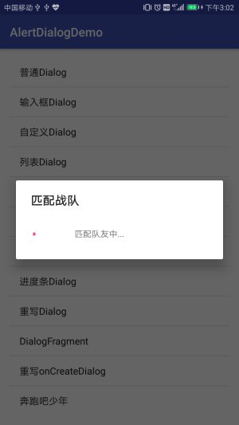

~~~
/**
	 * 加载Dialog
	 *
	 * @param context
	 */
	public static void showWaitingDialog(Context context) {
	/* 等待Dialog具有屏蔽其他控件的交互能力
	 * @setCancelable 为使屏幕不可点击，设置为不可取消(false)
     * 下载等事件完成后，主动调用函数关闭该Dialog
     */
		ProgressDialog waitingDialog =
				new ProgressDialog(context);
		waitingDialog.setTitle("匹配战队");
		waitingDialog.setMessage("匹配队友中...");
		waitingDialog.setIndeterminate(true);
//		waitingDialog.setCancelable(false);
		waitingDialog.show();
	}
~~~

# 进度条对话框

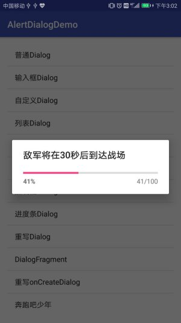

~~~
/**
	 * 进度条Dialog
	 *
	 * @param context
	 */
	public static void showProgressDialog(Context context) {
	/* @setProgress 设置初始进度
	 * @setProgressStyle 设置样式（水平进度条）
     * @setMax 设置进度最大值
     */
		final int MAX_PROGRESS = 100;
		final ProgressDialog progressDialog =
				new ProgressDialog(context);
		progressDialog.setProgress(0);
		progressDialog.setTitle("敌军将在30秒后到达战场");
		progressDialog.setProgressStyle(ProgressDialog.STYLE_HORIZONTAL);
		progressDialog.setMax(MAX_PROGRESS);
		progressDialog.show();
	/* 模拟进度增加的过程
	 * 新开一个线程，每个100ms，进度增加1
     */
		new Thread(new Runnable() {
			@Override
			public void run() {
				int progress = 0;
				while (progress < MAX_PROGRESS) {
					try {
						Thread.sleep(100);
						progress++;
						progressDialog.setProgress(progress);
					} catch (InterruptedException e) {
						e.printStackTrace();
					}
				}
				// 进度达到最大值后，窗口消失
				progressDialog.cancel();
			}
		}).start();
	}
~~~

# 重写Dialog实现对话框

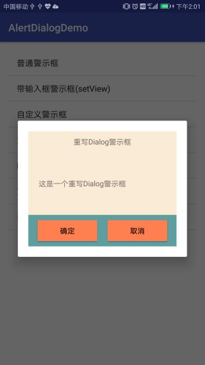

Dialog重写的主要代码:

~~~
package com.huyd.views;

import android.app.Dialog;
import android.content.Context;
import android.content.DialogInterface;
import android.view.LayoutInflater;
import android.view.View;
import android.view.ViewGroup.LayoutParams;
import android.widget.Button;
import android.widget.LinearLayout;
import android.widget.TextView;

import com.huyd.alertdialogdemo.R;

/**
 * Author: huyd
 * Date: 2017-08-02
 * Time: 19:50
 * Describe:重写Dialog
 */
public class CustomDialog extends Dialog {

	public CustomDialog(Context context) {
		super(context);
	}

	public CustomDialog(Context context, int themeResId) {
		super(context, themeResId);
	}

	public static class Builder {
		private Context context;
		private String title;
		private String message;
		private String positiveButtonText;
		private String negativeButtonText;
		private View contentView;
		private DialogInterface.OnClickListener positiveButtonClickListener;
		private DialogInterface.OnClickListener negativeButtonClickListener;

		public Builder(Context context) {
			this.context = context;
		}

		public Builder setTitle(String title) {
			this.title = title;
			return this;
		}

		public Builder setTitle(int title) {
			this.title = (String) context.getText(title);
			return this;
		}

		public Builder setMessage(String message) {
			this.message = message;
			return this;
		}

		public Builder setMessage(int message) {
			this.message = (String) context.getText(message);
			return this;
		}

		/**
		 * 设置确定按钮
		 *
		 * @param positiveButtonText
		 * @param listener
		 * @return
		 */
		public Builder setPositiveButton(int positiveButtonText,
		                                 DialogInterface.OnClickListener listener) {
			this.positiveButtonText = (String) context
					.getText(positiveButtonText);
			this.positiveButtonClickListener = listener;
			return this;
		}

		public Builder setPositiveButton(String positiveButtonText,
		                                 DialogInterface.OnClickListener listener) {
			this.positiveButtonText = positiveButtonText;
			this.positiveButtonClickListener = listener;
			return this;
		}

		public Builder setNegativeButton(int negativeButtonText,
		                                 DialogInterface.OnClickListener listener) {
			this.negativeButtonText = (String) context
					.getText(negativeButtonText);
			this.negativeButtonClickListener = listener;
			return this;
		}

		public Builder setNegativeButton(String negativeButtonText,
		                                 DialogInterface.OnClickListener listener) {
			this.negativeButtonText = negativeButtonText;
			this.negativeButtonClickListener = listener;
			return this;
		}

		// 这是自定义弹出框的关键
		public CustomDialog create() {
			LayoutInflater inflater = (LayoutInflater) context
					.getSystemService(Context.LAYOUT_INFLATER_SERVICE);
			// instantiate the dialog with the custom Theme
			final CustomDialog dialog = new CustomDialog(context,
					R.style.AppTheme);
			View layout = inflater.inflate(R.layout.cuntom_dialog, null);
			dialog.addContentView(layout, new LayoutParams(
					LayoutParams.MATCH_PARENT, LayoutParams.WRAP_CONTENT));
			// 设置标题
			((TextView) layout.findViewById(R.id.title)).setText(title);
			// 设置确认按钮
			if (positiveButtonText != null) {
				((Button) layout.findViewById(R.id.positiveButton))
						.setText(positiveButtonText);
				if (positiveButtonClickListener != null) {
					((Button) layout.findViewById(R.id.positiveButton))
							.setOnClickListener(new View.OnClickListener() {
								public void onClick(View v) {
									positiveButtonClickListener.onClick(dialog,
											DialogInterface.BUTTON_POSITIVE);
								}
							});
				}
			} else {
				//如果没有确认按钮则隐藏
				layout.findViewById(R.id.positiveButton).setVisibility(
						View.GONE);
			}
			// 设置取消按钮
			if (negativeButtonText != null) {
				((Button) layout.findViewById(R.id.negativeButton))
						.setText(negativeButtonText);
				if (negativeButtonClickListener != null) {
					((Button) layout.findViewById(R.id.negativeButton))
							.setOnClickListener(new View.OnClickListener() {
								public void onClick(View v) {
									negativeButtonClickListener.onClick(dialog,
											DialogInterface.BUTTON_NEGATIVE);
								}
							});
				}
			} else {
				//如果没有取消按钮则隐藏
				layout.findViewById(R.id.negativeButton).setVisibility(
						View.GONE);
			}
			// 设置消息
			if (message != null) {
				((TextView) layout.findViewById(R.id.message)).setText(message);
			} else if (contentView != null) {
				((LinearLayout) layout.findViewById(R.id.content))
						.removeAllViews();
				((LinearLayout) layout.findViewById(R.id.content)).addView(
						contentView, new LayoutParams(LayoutParams.MATCH_PARENT,
								LayoutParams.MATCH_PARENT));
			}
			// 把设置好的View加载到弹出框
			dialog.setContentView(layout);
			return dialog;
		}

	}

}

~~~

实现Dialog的主要方法:

~~~
/**
	 * 重写Dialog警示框
	 *
	 * @param context
	 */
	public static void showOverrideAlertDialog(final Context context) {
		CustomDialog.Builder builder = new CustomDialog.Builder(context);
		builder.setMessage("这是一个重写Dialog警示框");
		builder.setTitle("重写Dialog警示框");
		builder.setPositiveButton("确定", new DialogInterface.OnClickListener() {
			@Override
			public void onClick(DialogInterface dialogInterface, int i) {

				Toast.makeText(context, "确定", Toast.LENGTH_SHORT).show();
				dialogInterface.dismiss();

			}
		});
		builder.setNegativeButton("取消", new DialogInterface.OnClickListener() {
			@Override
			public void onClick(DialogInterface dialogInterface, int i) {
				Toast.makeText(context, "取消", Toast.LENGTH_SHORT).show();
				dialogInterface.dismiss();

			}
		});
		builder.create().show();
	}
~~~

# DialogFragment方式实现警示框

创建view可以通过两个途径，一是fragment中的onCreateView()，二是DialogFragment中的onCreateDialog()。
前者适合对自定义的layout进行设置，具有更大的灵活性
而后者适合对简单dialog进行处理，可以利用Dialog.Builder直接返回Dialog对象
从生命周期的顺序而言，先执行onCreateDialog()，后执行oonCreateView()，我们不应同时使用两者。

## 重写onCreateView方式

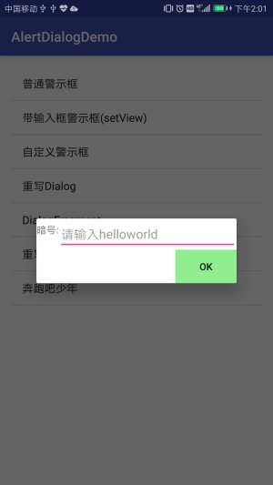

自定义一个布局文件(R.layout.fragment_alert_dialog),布局文件很简单,自行设计.然后创建一个继承DialogFragment的类,在onCreateView具体实现.

~~~
public class SelfDialogFragment extends android.app.DialogFragment {

	private EditText editText;
	private Button button;

	@Nullable
	@Override
	public View onCreateView(LayoutInflater inflater, ViewGroup container, Bundle savedInstanceState) {

		View view = inflater.inflate(R.layout.fragment_alert_dialog, container);
		editText = view.findViewById(R.id.id_txt_your_name);
		button = view.findViewById(R.id.id_sure_edit_name);
		button.setOnClickListener(new View.OnClickListener() {
			@Override
			public void onClick(View view) {
				String name = editText.getText().toString();
				if (name.equals("helloworld")) {
					Intent intent = new Intent(getActivity(), SelfActivity.class);
					intent.putExtra("name", name);
					startActivity(intent);
				} else {
					Toast.makeText(getActivity(), "暗号错误!", Toast.LENGTH_SHORT).show();
				}

			}
		});
		return view;
	}
}

~~~

Activity中使用如下:

~~~
//继承DialogFragment重写onCreateView方法
SelfDialogFragment selfDialogFragment = new SelfDialogFragment();
selfDialogFragment.show(getFragmentManager(), "Dialog");
~~~

## 重写onCreateDialog方式

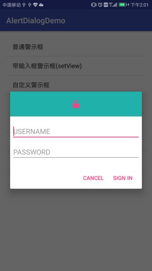

还是自定义一个布局文件(R.layout.login_alert_dialog),布局文件很简单,自行设计.然后创建一个继承DialogFragment的类,在onCreateDialog具体实现.

此处数据传递采用了回调的方法,具体看代码:

~~~
public class LoginDialogFragment extends DialogFragment {
	private EditText username;//用户名
	private EditText password;//密码

	//回调接口
	public interface LoginInputListener {
		void onLoginInputComplete(String username, String passwrod);
	}

	@Override
	public Dialog onCreateDialog(Bundle savedInstanceState) {
		AlertDialog.Builder builder = new AlertDialog.Builder(getActivity());
		LayoutInflater inflater = getActivity().getLayoutInflater();
		View view = inflater.inflate(R.layout.login_alert_dialog, null);
		username = view.findViewById(R.id.id_txt_username);
		password = view.findViewById(R.id.id_txt_password);
		builder.setView(view)
				.setPositiveButton("Sign In", new DialogInterface.OnClickListener() {
					@Override
					public void onClick(DialogInterface dialogInterface, int i) {
						// 利用回调方法传递usernmae和password参数
						LoginInputListener loginInputListener = (LoginInputListener) getActivity();
						loginInputListener.onLoginInputComplete(username.getText().toString(), password.getText().toString());

//						Toast.makeText(getActivity(), "Sign In", Toast.LENGTH_SHORT).show();
					}
				})
				.setNegativeButton("Cancel", null);
		return builder.create();
	}
}
~~~

Activity中实现LoginDialogFragment.LoginInputListener接口,获取数据代码如下:

~~~
//LoginDialogFragment中回调方法,传递username,password参数
	@Override
	public void onLoginInputComplete(String username, String passwrod) {
		Intent intent = new Intent(MainActivity.this, LoginAlertDialogActivity.class);
		intent.putExtra("info", username + " " + passwrod);
		startActivity(intent);
	}
~~~

Activity中实现警示框代码:

~~~
//继承DialogFragment重写onCreateDialog方法
LoginDialogFragment loginDialogFragment = new LoginDialogFragment();
loginDialogFragment.show(getFragmentManager(), "Login");
~~~

# 模仿美团实现加载的警示框

此处演示如上,由于截图原因呈现静态,实际为动态效果.代码稍多,具体见源码.

