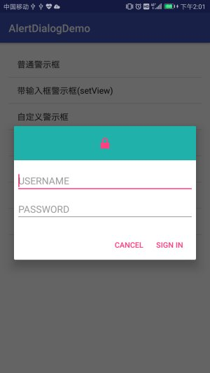

# AndroidApplication
# 前言

包含了许多Android小程序.主要实现了Android开发的各个功能.以下为各个项目的简介.

- AlertDialogDemo
- ServicePro
- SnackbarPro

# AlertDialogDemo

在实际开发中,会经常用到各种各样的对话框,Android 也提供了丰富的dialog函数.再次记录下Android 对话框的几种实现方式,以及自定义Dialog.

- [普通Dialog](#普通Dialog)
- [输入框的Dialog](#输入框的Dialog)
- [自定义布局实现Dialog](#自定义布局实现Dialog)
- [列表Dialog](#列表Dialog)
- [单选Dialog](#单选Dialog)
- [多选Dialog](#多选Dialog)
- [加载Dialog](#加载Dialog)
- [进度条Dialog](#进度条Dialog)
- [重写Dialog实现Dialog](#重写Dialog实现Dialog)
- [DialogFragment方式实现Dialog](#DialogFragment方式实现Dialog)
  - [重写onCreateView方式](#重写onCreateView方式)
  - [重写onCreateDialog方式](#重写onCreateDialog方式)
- [模仿美团实现加载的Dialog](#模仿美团实现加载的Dialog)

## 演示图片

# ServicePro

Service是Android系统中的四大组件之一，主要有两个应用场景：后台运行和跨进程访问。Service是Android中实现程序后台运行的解决方案,它非常适合用于去执行那些不需要和用户交互而且还要求长期运行的任务.服务的运行不依赖与任何界面,即使当程序切换到后台,或者用户打开另一个应用程序,服务仍然可以保持后台运行.Service可以在后台执行长时间运行操作而不提供用户界面，除非系统必须回收内存资源，否则系统不会停止或销毁服务。

另外服务并不会自动开启线程,所有代码都是默认运行在主线程中.如果需要在服务内部进行耗时操作,那么需要手动创建子线程,要不然可能就会出现主线程被阻塞住的情况.

- [Service的种类](#Service的种类)
  - [按运行地点分类](#按运行地点分类)
  - [按运行类型分类](#按运行类型分类)
  - [按使用方式分类](#按使用方式分类)
- [Service生命周期](#Service生命周期)
  - [相关方法详解](#相关方法详解)
- [Service实现方式](#Service实现方式)
  - [StartService启动Service](StartService启动Service)
  - [BindService启动Service](#BindService启动Service)
  - [ServiceIntent实现](#ServiceIntent实现)
  - [AIDL跨进程通信](#AIDL跨进程通信)
    - [AIDL是什么？](#AIDL是什么？)
    - [AIDL实现两个进程间的简单通信](#AIDL实现两个进程间的简单通信)

# 

# SnackbarPro

Snackbar使用方式,以及自定义Snackbar和Snackbar的封装实现