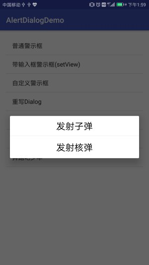
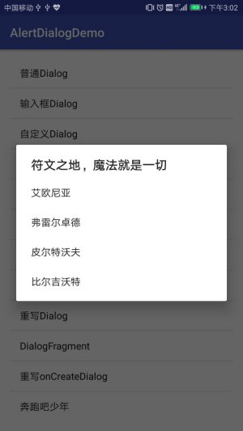
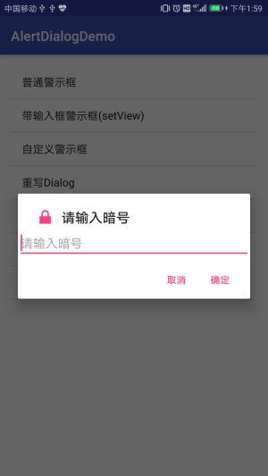
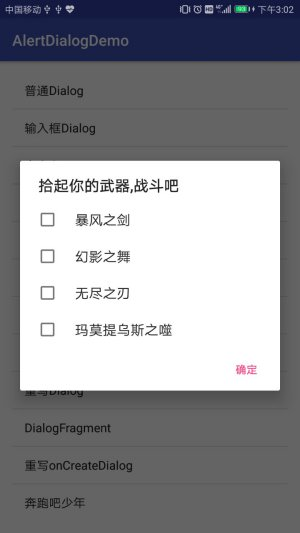

# AndroidApplication
# 前言

包含了许多Android小程序.主要实现了Android开发的各个功能.以下为各个项目的简介.

# AlertDialogDemo

在实际开发中,会经常用到各种各样的对话框,Android 也提供了丰富的dialog函数.再次记录下Android 对话框的几种实现方式,以及自定义Dialog.

- [普通Dialog](#普通Dialog)
- [输入框的Dialog](#输入框的Dialog)
- [自定义布局实现Dialog](#自定义布局实现Dialog)
- [列表Dialog](#列表Dialog)
- [单选Dialog](#单选Dialog)
- [多选Dialog](#多选Dialog)
- [加载Dialog](#加载Dialog)
- [进度条Dialog](#进度条Dialog)
- [重写Dialog实现Dialog](#重写Dialog实现Dialog)
- [DialogFragment方式实现Dialog](#DialogFragment方式实现Dialog)
  - [重写onCreateView方式](#重写onCreateView方式)
  - [重写onCreateDialog方式](#重写onCreateDialog方式)
- [模仿美团实现加载的Dialog](#模仿美团实现加载的Dialog)

## 演示图片

